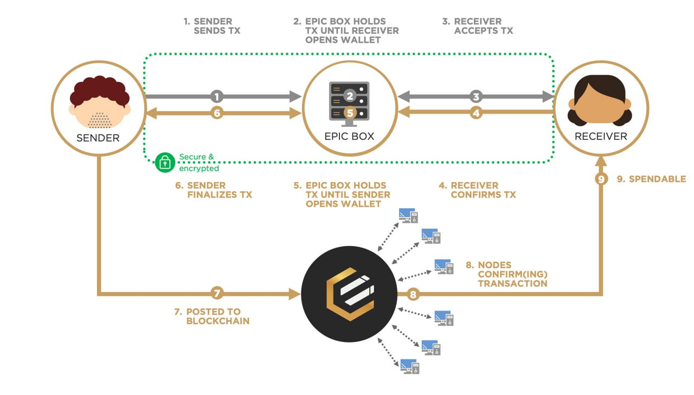

## Python EpicBox implementation
Experimental implementation of the epicbox transaction relay in Python

Inspired by https://github.com/fastepic/epicboxnodejs

---

### Requirements
- Ubuntu 20.04 / 22.04 
- Python 3.11
- Access to running instance of POSTGRESQL database

### Installation
1. Create virtual environment
    - `python3.11 -m venv env`
    - `source env/bin/activate`
2. Install requirements
   - `pip install -r requirements.txt`
3. Set permissions to `epicboxlib`
   - `sudo chmod a+rwx src\epicboxlib`
4. Configure `src/epicbox.toml` file
5. Run instance
   `python main.py`

---

### Credits
Created and managed by [@blacktyg3r](https://github.com/blacktyger), 
thanks to [@fastepic](https://github.com/fastepic) and the Epic Community.

Contact: [Telegram](https://t.me/blacktyg3r).
